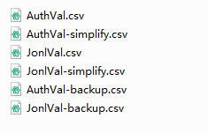

# ScholarAlertGmail2Html

* Use GmailApi to get Google Scholar alerts from Gmail within a certain date range, combine and sort the alert publications according to the weights of alert authors, journals and alert types. Then, save them as one single html file.    
* 使用GmailApi从Gmail获取一定日期范围内的Google Scholar快讯，根据快讯来源、快讯类型和期刊的权重对快讯文章进行综合排序。然后，将它们保存为一个的html文件。  

## Workflow / 工作流程
1. Get emails sent by Google Scholar Alerts account (scholaralerts-noreply@google.com) using GmailApi based on the time range provided by the user.  
* 根据用户提供的时间范围，使用GmailApi 获取Google Scholar Alerts账户（scholaralerts-noreply@google.com）发送的邮件。  
2. Cache email ids and email contents as a `pkl` file to avoid frequent reading of GmailAPI.  
* 缓存电子邮件id和电子邮件内容为`pkl`文件，避免频繁读取GmailAPI。  
3. Analyze the publications in emails, create a list of alerts types and published journals based on email subjects and contents, and cache the lists into `csv` table files in `/csv`    
* 分析邮件中的文章，根据邮件和文章内容建立快讯类型和发表期刊的列表，将列表缓存到`/csv`下的`csv`文件中
4. Users modify the alerts author weights, alerts type weights and publication journal weights in the `csv` tables in `/csv` according to the authors and journals they care about. If no changes are made, the default weights are used.
* 使用者根据自己关心的快讯作者和期刊修改`/csv`下的`csv`列表中的快讯作者权值、快讯类型权值和发表期刊权值。如果不修改则使用默认权值。
5. Sort the publications according to the alerts author weights, alerts type weights and publication journal weights.
* 根据快讯作者权值、快讯类型权值和发表期刊权值，对文章进行排序。  
6. Summarize the sorted publications into a single `html` file in `/html` folder.
* 将排序后的文章汇总成成单个`html`文件，保存在`/html`文件夹下。 

## Setting for first use / 初次使用
* Follow the steps in [Gmail API Client Library](https://developers.google.com/gmail/api/quickstart/python) ,  rename the `client_secret_XXXXXXXX_.json` to
`credentials.json`  and place it into the `/json` folder. When you firstly run the `ScholarAlertGmail2html.py`, you will get a `token.joson` in `/json` folder.
  * If you can't access the google api directly, you can use a proxy as a global proxy
    ```python
    import os
    # Use http proxy as a global proxy
    os.environ["http_proxy"] = "http://127.0.0.1:10809"
    os.environ["https_proxy"] = "http://127.0.0.1:10809"
    ```
    change to your proxy setting and insert the code before the main function in `quickstart.py`  
  <br>
* 按照[Gmail API Client Library](https://developers.google.com/gmail/api/quickstart/python) 中的步骤，将`client_secret_XXXXXX_.json`重命名为`credentials.json`并放入`/json`文件夹。当你第一次运行`ScholarAlertGmail2html.py`时，你会在`/json`文件夹中得到`token.joson`。
## Usage
* Run `ScholarAlertGmail2html.py` using Python 3.
* If you can't access the google api directly, you can use a proxy as a global proxy by remove the markers in the `ScholarAlertGmail2html.py`
```python
import os
# Use http proxy as a global proxy
os.environ["http_proxy"] = "http://127.0.0.1:10809"
os.environ["https_proxy"] = "http://127.0.0.1:10809"
```

## CSV Files in `/CSV`
